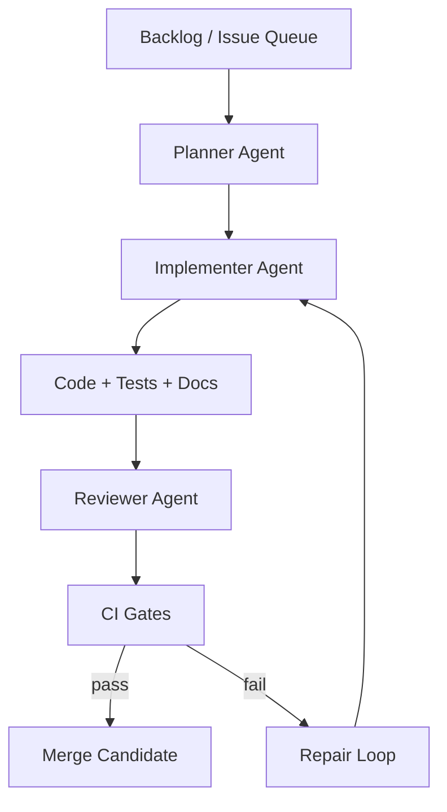

# Markdown 编辑器项目的 Agent 长期运行方案

版本：v1.0  
日期：2026-04-14

---

## 1. 目标

你不是只想“让 AI 帮你写一点代码”，而是想让 agent **长期、稳定、低跑偏地推进一个真实软件项目**。

这个目标的关键，不是换一个更强模型，而是设计一套 **能持续交付的小闭环**：

- 任务始终足够小
- 上下文始终稳定
- 代码质量有自动门禁
- agent 能做实现，但不能无限扩张范围
- 人只在关键决策点介入

---

## 2. 两种可行模式

## 模式 A：本地交互式 agent（最低门槛，最适合前期）

适合你现在立刻开工。

### 推荐方式
- 使用本地 coding agent 在仓库目录持续工作
- 让它读取设计文档、任务清单、测试要求
- 由你决定每次推进哪个任务

### 优点
- 最容易上手
- 出错时最容易纠偏
- 非常适合 MVP 阶段
- 适合处理 UI、编辑器行为这类需要频繁试跑的工作

### 推荐工具形态
- 本地 coding agent，能：
  - 读取仓库
  - 修改文件
  - 运行命令
  - 执行测试
  - 生成补丁

例如，OpenAI 官方的 Codex CLI 就是一个本地 coding agent，能在终端中读取仓库、改代码并运行命令。  
它更适合“你在旁边盯着推进”的持续开发方式。  
参考：
- https://developers.openai.com/codex/cli

## 模式 B：仓库驱动的长时 agent pipeline（更工程化，适合长期自动推进）

适合你在 MVP 稳定后再搭。

### 推荐架构
- 任务源：GitHub Issues / 本地 backlog 文件
- 编排层：你自己的 agent orchestrator
- 执行层：实现 agent / 评审 agent / 测试 agent
- 状态层：任务状态、历史总结、失败原因、架构决议
- 门禁：lint / test / e2e / snapshot
- 合并策略：只有通过门禁才允许进入主分支

如果你要真正让 agent 处理长时间任务，OpenAI 官方文档推荐使用 **Responses API + background mode**；  
其中 background mode 就是为长时任务设计的。  
对于 agent 编排，官方也提供 **Agents SDK**。  
参考：
- https://developers.openai.com/api/docs/guides/background
- https://developers.openai.com/api/docs/guides/agents-sdk
- https://developers.openai.com/api/docs/guides/migrate-to-responses

---

## 3. 结论：你应该怎么选

### 现在就开始
选 **模式 A**。

### 当项目进入持续迭代
升级到 **模式 B**。

### 原因
这个项目最难的部分是交互与体验，不是大规模后台批处理。  
所以前期最需要的是：

- 快速试错
- 高频验证
- 人随时校正交互方向

而不是一开始就搭一个过度复杂的 autonomous system。

---

## 4. 推荐的长期运行总体结构



---

## 5. 必须先建立的“项目约束文件”

为了让任何 agent 不跑偏，仓库里至少放这几类文件：

1. `docs/design.md`
2. `AGENTS.md`
3. `MVP_BACKLOG.md`
4. `DECISIONS.md`
5. `TESTING.md`
6. `CHANGELOG.md`

### 作用

- `design.md`：讲清技术方向，不让 agent 随意换栈
- `AGENTS.md`：讲清 agent 的行为边界
- `MVP_BACKLOG.md`：把大项目拆成可执行小任务
- `DECISIONS.md`：记录为什么这样做，避免反复推翻
- `TESTING.md`：规定每个任务至少跑哪些测试
- `CHANGELOG.md`：积累演进历史，让后续 agent 快速接棒

---

## 6. Agent 的工作边界

## 6.1 agent 可以做什么

- 新建和修改代码
- 补测试
- 修 lint / 类型错误
- 实现一个明确的小功能
- 改善文档
- 重构局部模块
- 给出待确认选项

## 6.2 agent 不应自行做什么

- 未经批准更换核心技术栈
- 大规模目录重构
- 一次性改很多不相关模块
- 引入新的重型依赖而不说明理由
- 改写设计目标
- 自动实现“看起来很酷但没在 backlog 里”的功能

## 6.3 单次任务体积上限

建议强制要求：

- 单次任务只做 **一个清晰目标**
- 代码 diff 尽量控制在 **300~800 行**
- 超过上限必须拆任务
- 任何任务都必须带验收条件

---

## 7. Backlog 组织方式

建议按 Epic -> Task -> Acceptance 的形式维护。

## 7.1 Epic 示例

### Epic 1：最小桌面壳
- 创建 Electron + Vite + React + TypeScript 工程
- 跑通主进程 / preload / 渲染层
- 可打开一个空窗口

### Epic 2：文档读写闭环
- 打开 `.md`
- 编辑文本
- 保存
- 自动保存
- 最近文件

### Epic 3：基础 Markdown 视图
- 标题渲染
- 列表渲染
- 引用渲染
- 链接显示
- active block 切换

### Epic 4：图片与资源
- 粘贴图片
- 拖拽图片
- assets 路径策略
- 冲突命名

### Epic 5：体验打磨
- 输入法稳定
- undo 粒度
- 大纲
- 搜索替换

## 7.2 Task 模板

```md
# TASK-012 实现图片粘贴落盘

## 目标
用户粘贴剪贴板图片时，自动保存到文档同级 assets 目录并插入相对路径。

## 输入
- 当前已存在文档保存逻辑
- 当前编辑器使用 CodeMirror 6

## 输出
- 图片保存服务
- 编辑器粘贴处理
- 错误提示
- 测试

## 约束
- 不引入云存储
- 不改动其他无关模块
- 文件名冲突必须处理

## 验收
- 粘贴 PNG 成功写入 assets
- Markdown 插入 ``
- 失败时不破坏当前编辑状态
- 有单元测试
```

---

## 8. 推荐的 agent 角色分工

## 8.1 Planner Agent
职责：

- 阅读 backlog
- 选择下一个最合适的小任务
- 输出实施计划
- 标记依赖关系与风险

输入：
- `MVP_BACKLOG.md`
- `docs/design.md`
- 当前代码状态

输出：
- 一个可执行任务卡
- 清晰验收条件

## 8.2 Implementer Agent
职责：

- 只实现当前任务
- 补必要测试
- 不越权扩张范围

输出：
- 代码修改
- 测试
- 变更说明

## 8.3 Reviewer Agent
职责：

- 检查是否跑偏
- 检查是否破坏架构
- 检查验收是否满足
- 检查测试是否充分

输出：
- approve / request changes
- 风险清单

## 8.4 Release Agent（后期）
职责：

- 生成 release note
- bump version
- 构建安装包
- 触发更新元数据发布

---

## 9. 推荐执行节奏

## 9.1 每次循环只做一个任务

最重要的纪律：

- 一个 agent run = 一个 task
- 完成后写总结
- 再进入下一个任务

不要让 agent 一口气“把整个编辑器做完”。

## 9.2 每天/每轮的最佳流程

1. Planner 选一个最小任务  
2. Implementer 实现并跑测试  
3. Reviewer 审查  
4. 人类只确认关键设计问题  
5. 合并  
6. 更新 backlog 与 changelog  

---

## 10. 必须建设的自动门禁

没有门禁，agent 长期运行一定会积累腐坏。

最少需要：

- `pnpm lint`
- `pnpm typecheck`
- `pnpm test`
- `pnpm e2e`（关键流程）
- 构建检查

对于这个项目，重点 e2e 场景建议固定为：

1. 打开文件  
2. 编辑文本  
3. 自动保存  
4. 重开恢复  
5. 粘贴图片  
6. 导出 HTML  

---

## 11. 长期运行的状态管理

## 11.1 每个任务结束时必须产出摘要

建议自动生成 `task-summary`，包括：

- 做了什么
- 改了哪些文件
- 测试是否通过
- 遇到什么问题
- 下一步建议是什么

## 11.2 维护决策日志

文件：`DECISIONS.md`

示例：

```md
## D-003 为什么不用 ProseMirror 作为第一版内核
日期：2026-04-14

原因：
1. 第一版更重视 Markdown 原文保真
2. 当前块源码 / 其他块渲染更适合文本为中心方案
3. 团队当前更熟悉 TypeScript + Electron + CM6
```

## 11.3 失败记忆也要保留

例如：

- 哪种 active block 实现导致输入法抖动
- 哪种 decoration 策略导致 selection 错位
- 哪种图片命名策略不稳定

这能显著减少 agent 反复踩坑。

---

## 12. 建议的仓库文件结构

```text
project-root/
  docs/
    design.md
    agent-runbook.md
    testing.md
    decisions.md
  tasks/
    TASK-001.md
    TASK-002.md
  reports/
    task-summaries/
  apps/
    desktop/
  packages/
    editor-core/
    markdown-engine/
  AGENTS.md
  MVP_BACKLOG.md
  CHANGELOG.md
```

---

## 13. 可直接使用的 AGENTS.md 约束

下面这段内容建议直接放进仓库根目录的 `AGENTS.md`：

```md
# AGENTS.md

## Project mission
Build a local-first Markdown desktop editor for macOS and Windows with a Typora-like single-pane editing experience.

## Core constraints
- Markdown text is the single source of truth.
- Do not replace the core stack without explicit approval.
- Current target stack: Electron + React + TypeScript + CodeMirror 6 + micromark.
- Optimize for UX stability, not feature count.
- Prefer small diffs and reversible changes.

## Task rules
- Work on one task at a time.
- Do not touch unrelated files.
- Do not introduce large dependencies unless necessary.
- Add tests for behavior changes.
- Update docs when architecture or behavior changes.

## Definition of done
A task is only done when:
- code builds
- lint passes
- tests pass
- acceptance criteria are satisfied
- a short task summary is written

## UX priorities
P0:
- IME stability
- cursor mapping
- undo/redo
- autosave safety
- Markdown round-trip safety

P1:
- outline
- search/replace
- image paste/drop
- export

P2:
- themes
- frontmatter UI
- math/mermaid
```

---

## 14. 适合 agent 的提示词模板

## 14.1 Planner 模板

```text
你是本项目的 Planner Agent。
请先阅读：
- docs/design.md
- MVP_BACKLOG.md
- AGENTS.md

任务：
1. 从 backlog 中选择一个最适合当前推进的小任务
2. 给出不超过 8 步的执行计划
3. 写出验收条件
4. 列出可能影响的文件
5. 明确哪些内容不要改
```

## 14.2 Implementer 模板

```text
你是 Implementer Agent。
请先阅读：
- docs/design.md
- AGENTS.md
- 当前任务卡

只实现当前任务，不要扩大范围。
要求：
1. 先说明计划修改哪些文件
2. 实现代码
3. 补充必要测试
4. 运行 lint/typecheck/test
5. 输出变更摘要
```

## 14.3 Reviewer 模板

```text
你是 Reviewer Agent。
请检查：
1. 是否满足任务验收
2. 是否修改了不相关文件
3. 是否引入不必要依赖
4. 是否破坏“Markdown 原文是唯一真相”的原则
5. 是否补了必要测试
6. 是否存在输入法、selection、undo 相关风险
```

---

## 15. 用 OpenAI 官方能力搭建工程化长时 agent 的建议

如果你要真正做成一个可持续运行的 agent 系统，而不是单纯终端对话，可以这样搭：

### 架构建议
- 编排 API：Responses API
- 长时任务：background mode
- 多 agent 协同：Agents SDK
- 开发期本地执行：Codex CLI
- 代码仓库：Git
- 事件源：Issue / Backlog / CI failure
- 结果回写：PR、task summary、decision log

### 为什么这样搭
- Responses API 是 OpenAI 官方推荐给新项目的主接口
- Responses 天生支持 agentic loop 和多种内建工具
- background mode 适合长时任务
- Agents SDK 适合你自己掌控 orchestration、tools、state
- Codex CLI 适合日常本地协作开发

---

## 16. 最务实的启动方案

直接照这个顺序做：

### 第 1 步
新建仓库并放入：
- `docs/design.md`
- `docs/agent-runbook.md`
- `AGENTS.md`
- `MVP_BACKLOG.md`

### 第 2 步
让本地 coding agent 只做 **TASK-001：项目骨架初始化**

### 第 3 步
完成后立刻补：
- lint
- typecheck
- 基础测试
- task summary

### 第 4 步
再让 agent 做 **TASK-002：打开/保存 Markdown 文件**

### 第 5 步
到 **TASK-005** 前都保持人工在环，不要全自动

### 第 6 步
当基础工程稳定后，再考虑把任务调度搬到后台 agent pipeline

---

## 17. 第一批推荐任务

1. 初始化 Electron + Vite + React + TypeScript 工程  
2. 搭建 main / preload / renderer 分层  
3. 实现打开 `.md` 文件  
4. 实现保存与自动保存  
5. 接入 CodeMirror 6  
6. 接入 micromark 并输出基础 block map  
7. 实现 heading / paragraph 的 active block 渲染  
8. 实现列表与引用  
9. 实现图片粘贴落盘  
10. 建立 Playwright e2e 冒烟测试  

---

## 18. 最后建议

你要的不是“会写代码的 agent”，而是“**在受控边界内持续产出的小团队替身**”。  
所以真正重要的是：

- 文档先行
- 小任务化
- 测试门禁
- 决策留痕
- 人只在关键节点判断方向

前期用本地交互式 coding agent 最值当；  
后期再把它升级成基于 Responses API + background mode + Agents SDK 的长时流水线。

---

## 19. 官方参考

- Codex CLI  
  https://developers.openai.com/codex/cli

- Responses API（推荐用于新项目）  
  https://developers.openai.com/api/docs/guides/migrate-to-responses

- Responses API Reference  
  https://developers.openai.com/api/reference/responses/overview/

- Background mode  
  https://developers.openai.com/api/docs/guides/background

- Agents SDK  
  https://developers.openai.com/api/docs/guides/agents-sdk
