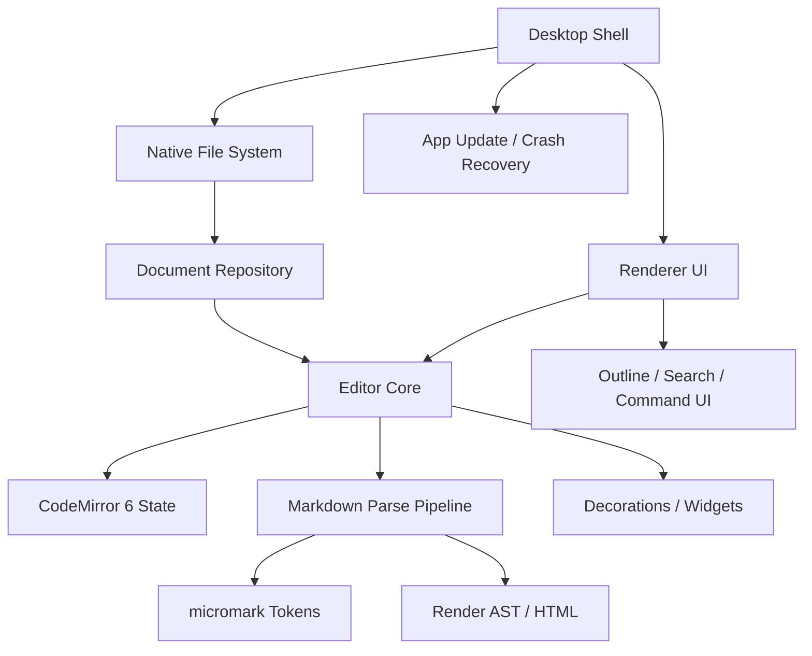
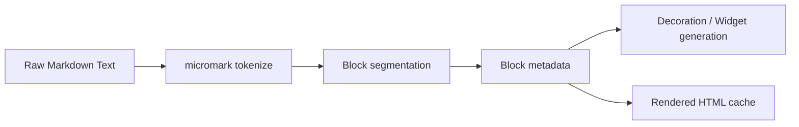
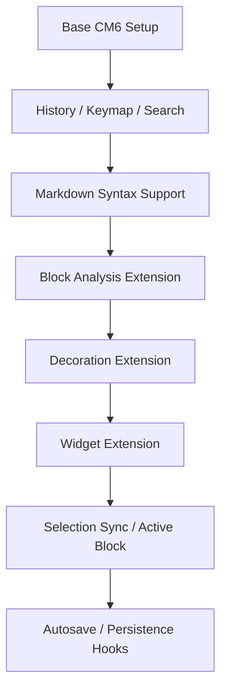
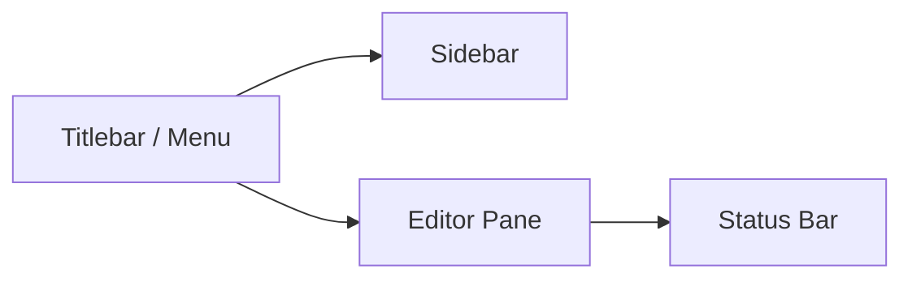

# Markdown 桌面编辑器设计文档（对标 Typora 体验）

版本：v1.0  
日期：2026-04-14  
定位：本地优先、跨平台（macOS / Windows）、单栏实时渲染的 Markdown 编辑器  
建议代号：Project VibeMD

---

## 1. 背景与目标

你希望做一款具有 Typora 那种“边写边看、几乎没有模式切换”的 Markdown 编辑器，但不受商业授权设备数量限制，同时在体验上进一步增强。

这个项目的核心价值不在“再做一个 Markdown 编辑器”，而在于：

1. **保留 Markdown 纯文本的可移植性**
2. **提供接近所见即所得的写作体验**
3. **跨 macOS / Windows 保持一致行为**
4. **把现代本地工作流做得比 Typora 更顺手**

---

## 2. 产品目标

## 2.1 成功定义

第一阶段成功，不是“功能很多”，而是满足以下体验：

- 打开 `.md` 文件即可开始写，不需要模式切换
- 当前编辑块显示源码，周围块显示渲染结果
- 中文输入法稳定，不乱跳光标
- 撤销/重做符合直觉
- 粘贴图片、拖拽图片、插入表格等高频操作顺手
- 保存后的 Markdown 文本尽量不被擅自改写
- 同一套代码在 macOS / Windows 体验尽量一致

## 2.2 非目标

第一版不做以下内容，避免项目失控：

- 实时多人协作
- 云同步
- 插件市场
- 移动端
- 全功能知识库系统（如双链图谱、数据库视图）
- 重度富文本能力（例如复杂排版版式系统）

---

## 3. 产品原则

## 3.1 Markdown 原文是唯一真相

磁盘文件和内存主状态都以 Markdown 文本为准。  
渲染、语法隐藏、块级 widget 都只是视图层。

这带来四个优势：

- git diff 干净
- 用户随时能切换回纯文本理解内容
- round-trip 风险低
- 导出链路简单

## 3.2 WYSIWYM，而不是完全 WYSIWYG

本项目追求的是：

- 正文区域尽量接近最终效果
- 但不牺牲 Markdown 可控性与可读性
- 当前块仍允许用户直接接触源码

## 3.3 本地优先

- 文件直接读写本地磁盘
- 自动保存
- 崩溃恢复
- 无账号也可完整使用
- 后续如做同步，也应建立在本地文件可独立工作基础上

## 3.4 体验优先于功能堆砌

优先把这些做好：

- 光标稳定
- 输入法稳定
- 长文档不卡
- 表格/图片/代码块顺手

而不是优先做“很多设置项”。

---

## 4. 技术路线选择

## 4.1 推荐主路线：Electron + CodeMirror 6 + micromark

### 选择原因

**Electron**
- 单套前端代码覆盖 macOS / Windows
- 内嵌统一 Chromium 环境，跨平台行为一致性较强
- 官方文档推荐用 Electron Forge 做打包发布
- 官方 `autoUpdater` 支持 macOS / Windows

**CodeMirror 6**
- 以 `state` / `view` / extension 为核心，适合做“编辑视图 + 渲染视图”的混合模式
- 可精细控制 transaction、selection、decoration、widget
- 适合处理大文档和复杂编辑扩展

**micromark**
- Markdown token 粒度细，带位置信息
- 适合将 Markdown 解析结果映射到编辑器中的块范围
- 有利于做“当前块源码、非当前块渲染”的 block-level 视图

### 为什么这是第一选择

因为你要做的是“极度依赖交互细节”的桌面编辑器，而不是普通网页编辑器。  
Electron 的优势是：**你把渲染环境也一并带走了**。  
这对于输入法、滚动、复制粘贴、布局一致性都更可控。

## 4.2 备选：Tauri 2 + 同样的前端核心

### 适用场景

当你后续更在乎：

- 安装包更小
- 内存占用进一步压缩
- Rust 能力扩展

### 风险

- Windows 上依赖 WebView2
- 相比 Electron，跨平台 UI 一致性需要更多实机验证
- 团队需要额外接受 Rust 相关构建链

## 4.3 快速原型备选：Milkdown / ProseMirror

### 优点

- 更容易更快做出富文本感的 Markdown 原型
- 插件生态成熟
- 若以后要协作，可对接 Y.js

### 不足

- 更偏“结构化富文本”
- Markdown round-trip 保真更难
- 容易在序列化时改变用户原文格式

### 结论

- **MVP：Electron + CodeMirror 6 + micromark**
- **将来可选：Tauri 壳层替换**
- **不建议用 ProseMirror/Milkdown 作为第一版内核**

---

## 5. 目标用户与关键场景

## 5.1 目标用户

- 技术写作者
- 开发者
- 博客作者
- 用 Markdown 写笔记/文档的知识工作者
- 希望本地文件优先的人

## 5.2 高频场景

1. 新建与打开 `.md`
2. 连续写作
3. 插入标题、列表、引用、链接
4. 粘贴图片并自动落盘
5. 写代码块和表格
6. 导出 HTML / PDF
7. 搜索、替换、大纲跳转
8. 打开很长的文档继续编辑

---

## 6. MVP 范围

## 6.1 必须做

- 单文档编辑
- 自动保存
- 崩溃恢复
- Markdown 实时渲染
- 当前块源码 / 其他块渲染
- 基础语法：
  - 标题
  - 段落
  - 粗体 / 斜体 / 删除线
  - 列表 / 任务列表
  - 引用
  - 行内代码 / 代码块
  - 链接
  - 图片
  - 表格
  - 分割线
- 目录大纲
- 全文查找替换
- 导出 HTML / PDF
- 主题（至少浅色 / 深色）
- 最近文件列表

## 6.2 可以第二阶段再做

- 多标签页
- 工作区 / 文件树
- frontmatter 可视编辑
- 数学公式
- mermaid
- 脚注
- wiki link
- 双向链接
- 本地版本历史
- 自定义 CSS 主题

---

## 7. 信息架构与模块边界



## 7.1 Desktop Shell（Electron Main）

职责：

- 应用生命周期
- 原生菜单
- 最近文件
- 文件打开/保存对话框
- 深色模式监听
- auto update
- 崩溃恢复入口
- OS 集成（如拖放、Recent Documents）

## 7.2 Preload / IPC Bridge

职责：

- 安全暴露有限 API 给渲染层
- 文件系统操作
- 配置读取与写入
- 导出命令
- 打开目录/文件命令

约束：

- 禁止渲染层直接拿 Node 完整能力
- 明确 IPC contract，避免野生 channel

## 7.3 Renderer UI

职责：

- 编辑器界面
- 状态栏
- 大纲面板
- 搜索替换
- 命令面板
- 偏好设置

## 7.4 Editor Core

职责：

- 文档状态管理
- selection / transaction 处理
- block 映射
- decorations / widgets
- 撤销重做
- 当前块与非当前块的显示策略

## 7.5 Markdown Pipeline

职责：

- parse Markdown -> token/block range
- 增量更新
- 渲染缓存
- 块级 HTML 生成
- 扩展语法注册

## 7.6 Document Repository

职责：

- 内存中的文档状态
- 文件路径、脏状态、保存时间
- 自动保存
- 崩溃恢复快照
- 资源文件路径策略

---

## 8. 核心交互设计

## 8.1 单栏实时编辑

核心体验：只有一个正文区域，无“编辑/预览”切换。

### 行为规则

- 光标所在块：显示更多源码细节
- 失焦块：尽量显示渲染结果
- 块间切换要自然，不闪烁
- 不能因渲染切换导致光标错位

## 8.2 当前块源码、其他块渲染

这是最接近 Typora 手感的关键。

### 基础策略

- 标题块：失焦时隐藏 `#`，聚焦时恢复可编辑语法
- 列表项：聚焦项显示 `- ` / `1. ` / `[ ]` 等前缀，其他项尽量弱化语法符号
- 引用块：失焦时弱化 `>`
- 链接：失焦时可显示为可点击文本，聚焦时显示 `[text](url)`
- 图片：失焦时显示图片卡片，聚焦时显示 Markdown 语法或悬浮编辑 UI
- 代码块：尽量保留 fence 的清晰编辑能力，不要过度隐藏
- 表格：失焦时做表格式展示，聚焦单元格附近仍保留文本可控性

### 不建议一开始完全隐藏的内容

- 代码块 fence
- 表格分隔线
- 复杂嵌套列表结构
- HTML block
- frontmatter
- 自定义扩展语法

原因：这些区域一旦隐藏过度，光标映射和撤销语义会显著变复杂。

## 8.3 输入法与组合态

必须优先保证：

- 中文拼音输入不丢字符
- 候选词期间 decoration 不重建
- compositionstart ~ compositionend 期间避免结构性 DOM 抖动
- 不在组合态中做激进格式替换

经验原则：

- 组合态期间只做最小视觉更新
- 复杂 parse / re-render 延迟到 compositionend 后

## 8.4 撤销/重做

必须满足：

- 连续输入自然合并为一个 undo chunk
- 自动格式化不要把一次普通输入拆成多步撤销
- 粘贴图片、自动插入链接、自动补全 fence 等要作为清晰原子操作

## 8.5 复制、粘贴、拖放

### 纯文本粘贴

- 默认保持文本语义
- 智能识别 URL，可选自动转链接

### 富文本粘贴

- 默认降级为合理 Markdown
- 不能引入脏 HTML 片段污染文档

### 图片粘贴/拖放

建议行为：

1. 检测剪贴板或拖放文件为图片
2. 将图片复制到文档同级 `assets/` 或配置目录
3. 自动生成稳定文件名
4. 插入相对路径 Markdown
5. 若同名冲突则自动追加 hash/序号

## 8.6 表格

第一版策略：

- 编辑底层仍是 Markdown table
- 失焦时增强视觉样式
- 可提供“插入列/行”的轻量工具
- 不支持超出 Markdown 能力范围的单元格合并

## 8.7 代码块

第一版策略：

- 支持语言标识
- 失焦时只做语法高亮
- 不做重型 IDE 化能力
- Tab、缩进、换行逻辑独立于普通段落

---

## 9. 文档模型

## 9.1 核心状态

```ts
type DocumentState = {
  filePath: string | null
  text: string
  version: number
  dirty: boolean
  lastSavedAt: number | null
  selection: {
    from: number
    to: number
  }
  activeBlockId: string | null
}
```

## 9.2 Block 映射模型

```ts
type BlockViewModel = {
  id: string
  type:
    | "paragraph"
    | "heading"
    | "blockquote"
    | "list_item"
    | "code_fence"
    | "table"
    | "image"
    | "html"
    | "thematic_break"
  from: number
  to: number
  renderMode: "source" | "rendered" | "hybrid"
  cacheKey: string
}
```

## 9.3 设计原则

- 文本始终为真
- block 是视图分层，不是主存储结构
- parse 结果可失效重建
- render cache 可以丢弃
- selection 必须能映射回原始文本 offset

---

## 10. 渲染与解析策略

## 10.1 解析流程



## 10.2 为什么不直接“Markdown -> HTML 一把梭”

因为你需要的不只是预览，而是：

- 原始字符位置
- 当前块范围
- 光标映射
- 细粒度重绘
- 增量更新

因此解析层至少要提供 **块范围 + token 位置**。

## 10.3 增量更新

第一版先做“局部重算”而不是极致增量：

- 根据 transaction 影响范围，向前向后扩张到最近 block 边界
- 重算受影响块
- 未受影响块复用 cache

这样实现复杂度合理，性能也足够覆盖大多数文档。

---

## 11. 编辑器内核设计（CodeMirror 6）

## 11.1 扩展分层



## 11.2 建议扩展拆分

- `core/baseSetup.ts`
- `core/markdownSyntax.ts`
- `core/activeBlock.ts`
- `core/blockMap.ts`
- `core/renderDecorations.ts`
- `core/imagePaste.ts`
- `core/tableAssist.ts`
- `core/codeFenceBehavior.ts`
- `core/autosave.ts`
- `core/search.ts`

## 11.3 为什么适合 CM6

因为需要高度自定义：

- transaction 监听
- decorations
- widgets
- selection 与可视块联动
- undo history
- keymap
- 大文档视口渲染

CM6 的 extension 架构天然适合这个项目。

---

## 12. 文件系统设计

## 12.1 存储策略

- 文档：用户指定路径的 `.md`
- 配置：用户目录下应用配置 JSON
- 崩溃恢复：本地恢复目录
- 图片资源：默认文档旁 `assets/`

## 12.2 自动保存

建议：

- 失焦或停止输入 800~1500ms 后自动保存
- 窗口失焦强制保存
- 应用退出前 flush
- 保存失败时给出轻提示与重试入口

## 12.3 崩溃恢复

策略：

- 编辑中每隔 N 秒保存草稿快照
- 启动时比对磁盘版本与恢复快照
- 若检测到异常退出，提示恢复

---

## 13. 导出设计

## 13.1 HTML 导出

第一版优先：

- Markdown -> HTML
- 注入当前主题 CSS
- 资源路径重写

## 13.2 PDF 导出

基于浏览器打印链路：

- HTML -> print to PDF
- 允许页边距、页眉页脚基础配置
- 第一版先不追求学术排版级别

---

## 14. UI 结构



### Sidebar（可折叠）
- 文档大纲
- 搜索结果
- 最近文件

### Editor Pane
- 单栏正文
- 内联工具条尽量克制
- 以键盘操作优先

### Status Bar
- 文件状态
- 字数
- 行列
- 当前语法块类型
- 保存状态

---

## 15. 安全与桌面应用约束

## 15.1 Electron 安全原则

- 禁用不必要的 Node 集成
- 使用 preload 暴露白名单 API
- IPC 严格做参数校验
- 渲染层不直接执行不可信 HTML
- 依赖更新节奏明确

## 15.2 Markdown 渲染安全

- 默认对潜在危险 HTML 做限制或隔离
- 外链点击要提示/在系统浏览器打开
- 本地图片渲染要限制协议与路径

---

## 16. 跨平台差异处理

## 16.1 macOS

- 原生菜单体验重要
- 标准快捷键需符合系统习惯
- 窗口关闭与退出语义要符合 macOS 用户预期

## 16.2 Windows

- 文件关联、安装器、自动更新、WebView/渲染差异需重点测试
- 高 DPI、字体 fallback、输入法要重点验证

---

## 17. 性能目标

MVP 性能目标：

- 打开 1~3 MB Markdown 文档可编辑
- 普通输入无明显卡顿
- 滚动流畅
- 切换 active block 不明显闪烁
- 图片较多的文档仍能基本可用

优化手段：

- 只重算受影响块
- 使用 render cache
- 非可视区域延迟渲染
- 大图片懒加载/缩略展示

---

## 18. 测试策略

## 18.1 自动化测试

### 单元测试
- block 切分
- Markdown token 映射
- 图片路径生成
- 自动保存状态机
- 键盘行为规则

### 集成测试
- 打开/编辑/保存/重开
- 粘贴图片
- 导出 HTML / PDF
- 查找替换
- 崩溃恢复

### 端到端测试
- macOS / Windows 启动
- 系统菜单
- 文件拖放
- 最近文件
- 快捷键

## 18.2 手工测试矩阵

重点必须手测：

- 中文输入法
- 日文输入法
- 多显示器缩放
- 超长文档
- 超大图片
- 非法路径 / 无权限目录
- 异常退出恢复

---

## 19. 里程碑计划

## M0：技术验证（1~2 周）
输出：
- Electron 壳跑通
- CodeMirror 6 基础编辑器
- Markdown 打开/保存
- micromark 基础解析
- 原型级 active block 切换

验收：
- 可以编辑并保存 `.md`
- 标题/列表/引用能做最小渲染

## M1：最小可用编辑器（2~4 周）
输出：
- 当前块源码 / 其他块渲染
- 自动保存
- 图片粘贴落盘
- 大纲
- 查找替换
- 基础主题

验收：
- 连续写作 30 分钟无明显阻塞
- 常用 Markdown 能顺畅输入

## M2：体验打磨（2~4 周）
输出：
- 撤销粒度优化
- 输入法稳定性提升
- 表格交互增强
- 导出 HTML / PDF
- 崩溃恢复

验收：
- 可作为日常写作主力工具尝试使用

## M3：增强能力（后续）
输出：
- 多标签
- frontmatter
- 数学公式
- mermaid
- 本地历史版本

---

## 20. 项目风险与应对

## 风险 1：输入法问题导致“能用但难用”
应对：
- 尽早实机测试中文输入法
- 组合态期间限制 decoration 更新
- 相关问题优先级设为 P0

## 风险 2：光标映射复杂度超预期
应对：
- 第一版只对有限块类型做强渲染
- 复杂块保留更多源码可见性
- 把 “rendered / source / hybrid” 做成可回退策略

## 风险 3：Markdown round-trip 被破坏
应对：
- 严禁“每次保存自动格式化全文”
- 格式修正只在用户显式操作时执行
- 建立 round-trip regression 测试

## 风险 4：项目被功能蔓延拖垮
应对：
- 每次迭代只允许一个主目标
- 先围绕写作主路径做闭环
- 所有“酷功能”延迟到 M2 以后

---

## 21. 推荐目录结构

```text
project-root/
  apps/
    desktop/
      src/
        main/
        preload/
        renderer/
  packages/
    editor-core/
    markdown-engine/
    shared/
  docs/
    design.md
    decisions/
  tests/
    e2e/
    integration/
  assets/
```

---

## 22. 推荐初始技术栈

- UI：React + TypeScript
- Desktop Shell：Electron
- Editor：CodeMirror 6
- Markdown Parse：micromark
- Test：Vitest + Playwright
- Build：Vite + Electron Forge
- State：优先轻量本地状态，不急着引入重型全局状态库
- Styling：CSS Variables / Tailwind 二选一，建议先选简单稳定方案

---

## 23. MVP 验收清单

- [ ] 可打开 `.md`
- [ ] 可编辑并自动保存
- [ ] 当前块源码 / 其他块渲染
- [ ] 标题/列表/引用/链接/图片/代码块/表格可用
- [ ] 粘贴图片自动落盘
- [ ] 大纲跳转
- [ ] 查找替换
- [ ] 导出 HTML
- [ ] 导出 PDF
- [ ] macOS / Windows 可打包运行
- [ ] 崩溃恢复可用
- [ ] 中文输入法基础稳定
- [ ] 撤销/重做体验可接受

---

## 24. 最终建议

这不是一个“算法难”的项目，而是一个“交互打磨难”的项目。  
所以最正确的启动方式不是一次性做大，而是：

1. 先用 Electron + CodeMirror 6 + micromark 跑通最小闭环  
2. 只做最核心的 15~20 条交互契约  
3. 用真实 Markdown 文档做日常试写  
4. 让 agent 持续在小任务上迭代，而不是放任它自由扩张功能

---

## 25. 参考依据（官方）

- Electron Forge：官方用于打包发布的工具  
  https://www.electronjs.org/docs/latest/tutorial/forge-overview

- Electron autoUpdater：内建自动更新支持 macOS / Windows  
  https://www.electronjs.org/docs/latest/api/auto-updater

- Electron Security：官方强调保持 Electron 版本更新与安全配置  
  https://www.electronjs.org/docs/latest/tutorial/security

- Tauri 2 WebView2 / Installer 说明  
  https://v2.tauri.app/reference/webview-versions/  
  https://v2.tauri.app/distribute/windows-installer/

- CodeMirror 6 Reference  
  https://codemirror.net/docs/ref/

- micromark  
  https://github.com/micromark/micromark

- Milkdown  
  https://milkdown.dev/
